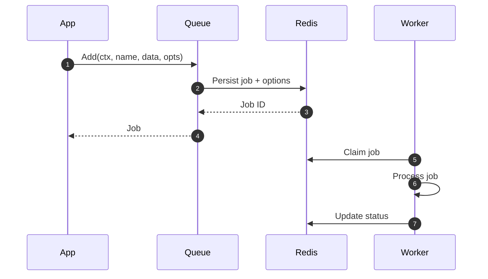

# Options

Configure jobs by passing functional options to `Queue.Add(...)`. This page focuses on how to use the options in your app code.

## Quick examples

```go
job, err := queue.Add(ctx, "process:image", imageData,
  gobullmq.AddWithPriority(1),
  gobullmq.AddWithAttempts(3),
  gobullmq.AddWithDelay(5_000),
)
```

```go
// Repeat every minute, keep only last 100 completed jobs
_, _ = queue.Add(ctx, "metrics:rollup", nil,
  gobullmq.AddWithRepeat(types.JobRepeatOptions{Every: 60_000}),
  gobullmq.AddWithRemoveOnComplete(gobullmq.KeepJobs{Count: 100}),
)
```

## Available options

- AddWithPriority(int): lower number = higher priority
- AddWithRemoveOnComplete(keep ...types.KeepJobs): remove job(s) after success; pass `KeepJobs` to keep some
- AddWithRemoveOnFail(keep ...types.KeepJobs): remove job(s) after failure; pass `KeepJobs` to keep some
- AddWithAttempts(int): maximum retry attempts
- AddWithDelay(ms int): initial delay before processing
- AddWithTimestamp(ms int64): custom enqueue timestamp
- AddWithJobID(string): custom job ID (must be unique)
- AddWithRepeat(types.JobRepeatOptions): schedule job on an interval or cron
- AddWithLifo(): push to the tail instead of head (LIFO)
- AddWithFailParentOnFailure(bool): fail parent if this job fails
- AddWithParent(types.ParentOpts): set parent job id and queue prefix
- AddWithRemoveDependencyOnFailure(bool): remove dependency from parent on failure

## KeepJobs

```go
type KeepJobs struct {
  Age   int // seconds
  Count int // max number of jobs to keep
}
```

Examples:

- Keep last 100 completed: `AddWithRemoveOnComplete(gobullmq.KeepJobs{Count: 100})`
- Keep failed jobs for 7 days: `AddWithRemoveOnFail(gobullmq.KeepJobs{Age: 7*24*60*60})`

## Repeat options

See Repeatable for a deeper walkthrough. Summary of fields:

- Pattern: cron expression (mutually exclusive with Every)
- Every: milliseconds interval (mutually exclusive with Pattern)
- StartDate, EndDate: optional scheduling window
- Limit: cap total runs
- TZ: IANA timezone (default UTC)
- Immediately: only with Every; schedule first run now

## Parent/child jobs

```go
parentQueuePrefix := "bull:parentQueueName" // prefix + ":" + name + ":"
_, _ = queue.Add(ctx, "child", childData,
  gobullmq.AddWithParent(types.ParentOpts{Id: parentId, Queue: parentQueuePrefix}),
)
```

Note: Parent/child orchestration relies on Lua scripts; you only need to provide the correct parent id and queue prefix.

## Diagrams


