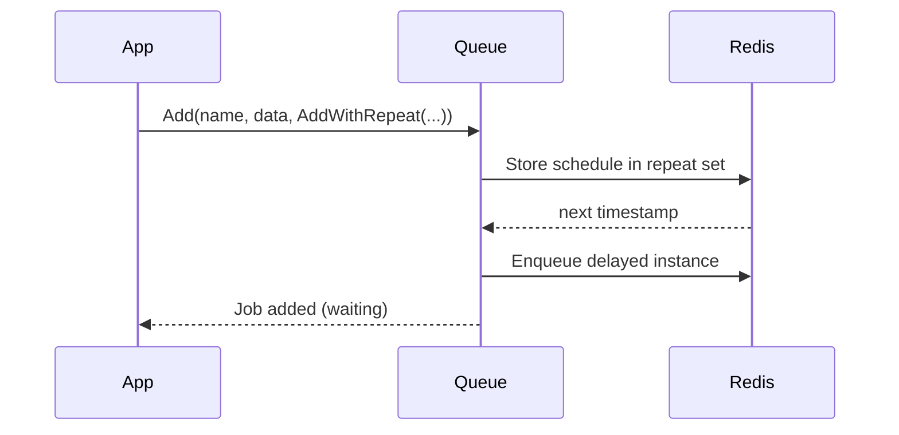

# Repeatable

Repeatable jobs let you run a job on a schedule: either at a fixed interval or using a cron expression. They are useful for tasks like sending reports, syncing data, or housekeeping. You configure them with `AddWithRepeat(...)` when adding a job.

## How to add a repeatable job

### Repeat at a fixed interval

```go
_, err := queue.Add(ctx, "report:daily", jobPayload,
  gobullmq.AddWithRepeat(types.JobRepeatOptions{
    Every: 5_000, // run every 5 seconds
  }),
)
if err != nil {
  log.Printf("add repeatable job failed: %v", err)
}
```

### Repeat with a cron pattern

```go
_, err := queue.Add(ctx, "cleanup:nightly", nil,
  gobullmq.AddWithRepeat(types.JobRepeatOptions{
    Pattern: "0 3 * * *", // every day at 03:00
    TZ:      "UTC",       // optional: IANA timezone
  }),
)
```

### Start/end window and limits

```go
start := time.Now().Add(10 * time.Minute)
end := start.Add(24 * time.Hour)
_, err := queue.Add(ctx, "campaign:ping", nil,
  gobullmq.AddWithRepeat(types.JobRepeatOptions{
    Every:     60_000,   // every minute
    StartDate: &start,   // don't run before this
    EndDate:   &end,     // stop after this
    Limit:     100,      // max occurrences
  }),
)
```

### Run the first occurrence immediately

```go
_, err := queue.Add(ctx, "metrics:push", nil,
  gobullmq.AddWithRepeat(types.JobRepeatOptions{
    Every:      30_000,
    Immediately: true, // schedule first run now
  }),
)
```

## Options reference

- Pattern: cron expression. Do not combine with Every.
- Every: interval in milliseconds. Do not combine with Pattern.
- StartDate, EndDate: optional time window.
- Limit: maximum number of executions.
- TZ: IANA timezone name (defaults to UTC).
- Immediately: only for Every; starts the first run right away.
- JobId: optional custom id seed for stable repeat keys.

Tip: set either Pattern or Every, not both.

## What gets scheduled under the hood

The queue computes the next run time and stores a repeat entry in Redis so the next instance is automatically enqueued with the correct delay. You can keep this mental model without knowing the internal functions.



## FAQs

- Can I use both Pattern and Every? No—choose one.
- How do I stop a repeatable job? Removal by key is not exposed as a public API yet; planned for a future release.
- What timezone is used? UTC by default; set `TZ` with an IANA name like "America/New_York".