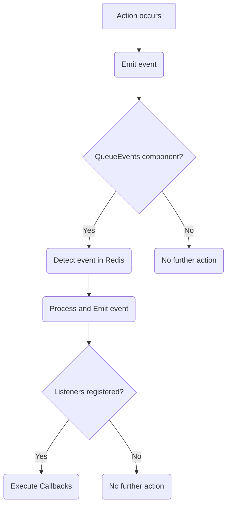
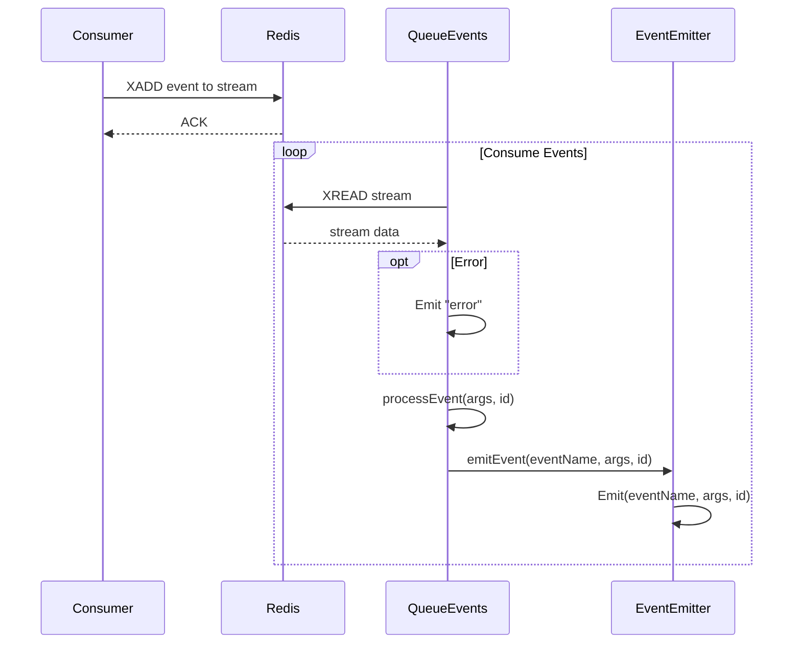

# Event Handling

Event handling is a core part of `gobullmq`. You can subscribe to events on queues, workers, and queue-events to react to lifecycle changes (e.g., job added, active, completed, failed). This page focuses on how to use these events in your application code.

## Overview of Event Handling

The `gobullmq` library uses a custom event emitter, implemented in `internal/eventEmitter/eventEmitter.go`, to manage events. This event emitter allows components to subscribe to specific events and execute callbacks when those events are emitted. The `QueueEvents` struct in `queue_events.go` acts as a bridge between the Redis streams and the internal event emitter, consuming events from Redis and emitting them within the Go application. This allows external processes or services to trigger actions within the `gobullmq` system by publishing events to the Redis stream.

### Key Components

- **EventEmitter:** Manages event listeners and emission.
- **QueueEvents:** Consumes events from Redis streams and emits them using the internal event emitter.

### Event Flow

The event flow typically involves the following steps:

1.  An action occurs within the system (e.g., a job is added, completed, or fails).
2.  The component performing the action emits an event using the `EventEmitter`.
3.  The `QueueEvents` component, if running, detects the event in the Redis stream.
4.  The `QueueEvents` component processes the event and emits it using its internal `EventEmitter`.
5.  Any listeners registered for that event receive the event data and execute their corresponding callbacks.



This diagram illustrates the general flow of events within the `gobullmq` system.

## Subscribing to events (quick start)

```go
// QueueEvents: listen to events from Redis stream
eventsClient := redis.NewClient(&redis.Options{Addr: "127.0.0.1:6379", DB: 0})
events, err := gobullmq.NewQueueEvents(ctx, "myQueue", gobullmq.QueueEventsOptions{
    RedisClient: eventsClient,
    Autorun:     true,
})
if err != nil { /* handle */ }

events.On("completed", func(args ...interface{}) {
    fmt.Println("Job completed:", args)
})

events.On("failed", func(args ...interface{}) {
    fmt.Println("Job failed:", args)
})
```

### Example Usage

```go
ee := eventemitter.NewEventEmitter()

ee.On("job.completed", func(args ...interface{}) {
    fmt.Println("Job completed:", args)
})

ee.Emit("job.completed", "jobID-123")
```

This code snippet demonstrates how to create an `EventEmitter`, subscribe to the `job.completed` event, and emit the event with some data.

## QueueEvents

The `QueueEvents` struct, defined in `queue_events.go`, is responsible for consuming events from a Redis stream and emitting them using the internal `EventEmitter`. You must provide a `redis.Cmdable` client; use a separate client from your queue/worker to avoid client name collisions.

### Common events

- Queue (emitted by `Queue`):
  - `waiting`: a job was added and is waiting to be processed
  - `paused` / `resumed`: queue paused/resumed
- Worker (emitted by `Worker`):
  - `active`: a job moved to active
  - `completed`: a job finished successfully
  - `failed`: a job failed
  - `error`: an internal error occurred
- QueueEvents (from Redis stream):
  - `added`, `active`, `completed`, `failed`, `progress`, `drained`, etc.

### Key Functions

| Function                | Description                                                                                                                                                                                        |
| ----------------------- | -------------------------------------------------------------------------------------------------------------------------------------------------------------------------------------------------- |
| `NewQueueEvents()`      | Creates a new `QueueEvents` instance, initializes the Redis client, and starts listening for events if `Autorun` is enabled.                                                                       |
| `Run()`                 | Starts the `QueueEvents` instance, connecting to the Redis stream and consuming events.                                                                                                            |
| `Close()`               | Stops the `QueueEvents` instance, closing the connection to the Redis stream and waiting for the background goroutine to finish.                                                                   |
| `consumeEvents()`       | Consumes events from the Redis stream, processing each event and emitting it using the internal `EventEmitter`.                                                                                    |
| `processEvent()`        | Processes a single event, extracting the event name and data, and emitting the event using the internal `EventEmitter`.                                                                            |
| `emitEvent()`           | Emits the event with the given name and arguments.                                                                                                                                                 |
| `Emit(event, args...)`  | Emits an event using the internal `EventEmitter`.                                                                                                                                                  |
| `On(event, listener)`   | Subscribes a listener function to a specific event using the internal `EventEmitter`.                                                                                                              |
| `Off(event, listener)`  | Removes a specific listener function from an event using the internal `EventEmitter`.                                                                                                              |
| `Once(event, listener)` | Subscribes a listener function to a specific event using the internal `EventEmitter`. The listener function is executed only once when the event is emitted, and then it is automatically removed. |

This table summarizes the key functions of the `QueueEvents` struct and their descriptions.

### Example: subscribe to a specific job ID

```go
events.On("completed:"+jobId, func(args ...interface{}) {
    fmt.Println("This job completed:", jobId)
})
```

This code snippet demonstrates how to create a `QueueEvents` instance and subscribe to the `completed` event.

### Event flow

Under the hood, `QueueEvents` reads from the `{queue}:events` Redis stream and re-emits those as Go callbacks you register with `On`/`Once`.



This sequence diagram illustrates how `QueueEvents` consumes and processes events from Redis.

## Queue component events (quick reference)

- `waiting`: job added
- `paused`: queue paused
- `resumed`: queue resumed

## Worker component events (quick reference)

- `active`: job moved to active
- `completed`: job finished successfully
- `failed`: job failed
- `error`: internal error
