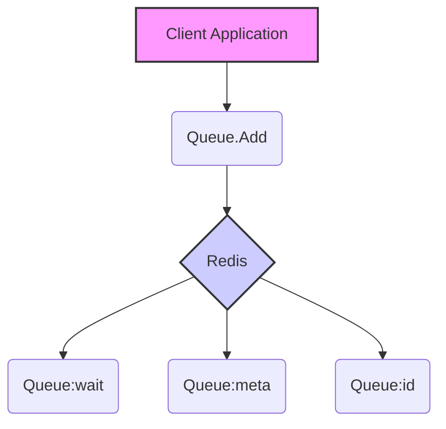
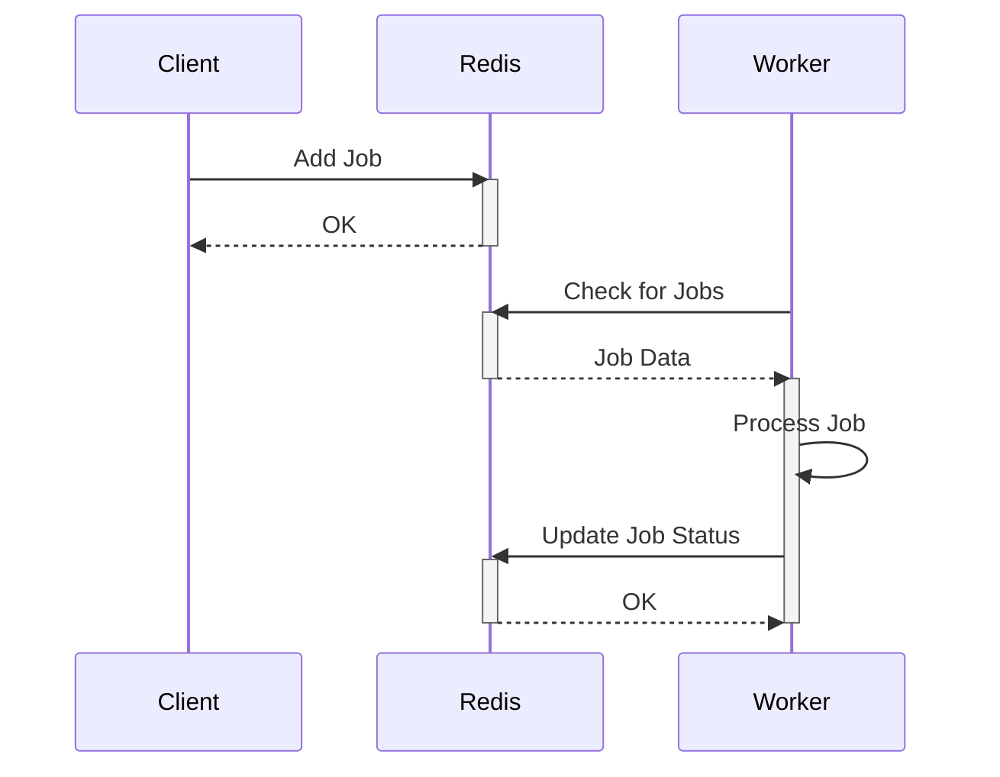

# Introduction

The `gobullmq` library provides a robust job queue system for Golang, leveraging Redis for managing and processing jobs. It offers features for creating queues, defining workers to process jobs concurrently, handling events during the job lifecycle, and scheduling repeatable jobs. The library aims to simplify the implementation of background tasks and distributed processing in Go applications.

This documentation provides an overview of the key components and functionalities of the `gobullmq` library, including queues, workers, and event handling. It details how to configure and use these components to effectively manage job processing in your applications. It also provides code snippets to help guide you.

## Queue Management

The `Queue` component in `gobullmq` is responsible for managing the job queue. It provides methods for adding jobs to the queue, pausing and resuming the queue, and checking the queue's paused state. The queue uses Redis to store job data and manage the queue's state.

### Creating a Queue

Create a queue by providing your own Redis client (e.g., `*redis.Client`) and optional functional options like a custom key prefix.

```go
queueClient := redis.NewClient(&redis.Options{Addr: "127.0.0.1:6379", DB: 0})
queue, err := gobullmq.NewQueue(ctx, "myQueue", queueClient,
    // Optional: Set a custom key prefix
    // gobullmq.WithKeyPrefix("myCustomPrefix"),
)
if err != nil {
    log.Fatalf("Failed to create queue: %v", err)
}
```

### Adding Jobs to a Queue

Jobs can be added to the queue using the `Add` method. This method takes the job name, job data, and a set of functional options as arguments. The job data can be any struct that can be serialized to JSON. The functional options allow you to configure the job's behavior, such as setting the job's priority and delay.

```go
jobData := struct {
    Message string
    Count   int
}{
    Message: "Hello BullMQ!",
    Count:   1,
}

// Add a job using functional options
job, err := queue.Add(ctx, "myJob", jobData,
    gobullmq.AddWithPriority(5),
    gobullmq.AddWithDelay(2000), // Delay by 2 seconds
)
if err != nil {
    log.Fatalf("Failed to add job: %v", err)
}
log.Printf("Added job %s with ID: %s\n", job.Name, job.Id)
```

### Pausing and Resuming a Queue

The `Pause` and `Resume` methods can be used to pause and resume the queue, respectively. When a queue is paused, new jobs will not be processed until the queue is resumed.

```go
// Pause pauses the queue, preventing new jobs from being processed.
func (q *Queue) Pause(ctx context.Context) error { // Added context
	if err := q.pause(ctx, true); err != nil {
		return fmt.Errorf("failed to pause queue: %w", err)
	}
	q.Emit("paused")
	return nil
}

// Resume resumes the queue, allowing jobs to be processed.
func (q *Queue) Resume(ctx context.Context) error { // Added context
	if err := q.pause(ctx, false); err != nil {
		return fmt.Errorf("failed to resume queue: %w", err)
	}
	q.Emit("resumed")
	return nil
}
```

### Checking if a Queue is Paused

The `IsPaused` method can be used to check if the queue is currently paused.

```go
// IsPaused checks if the queue is currently paused.
func (q *Queue) IsPaused(ctx context.Context) (bool, error) { // Added context and error return
	pausedKeyExists, err := q.Client.HExists(ctx, q.KeyPrefix+"meta", "paused").Result()
	return pausedKeyExists, err
}
```

### Functional Options

The following functional options are available for configuring a queue:

| Option                           | Description                                                |
| -------------------------------- | ---------------------------------------------------------- |
| `WithKeyPrefix(string)`          | Sets a custom prefix for Redis keys (default is "bull").   |
| `WithStreamsEventsMaxLen(int64)` | Sets the max length for the events stream (default 10000). |

### Data Flow Diagram



This diagram illustrates the data flow when adding a job to the queue. The client application calls the `Add` method on the `Queue` object, which then stores the job data in Redis. The job is added to the `wait` queue, and metadata and ID information are also stored in Redis.

## Worker Processing

The `Worker` component in `gobullmq` is responsible for processing jobs from the queue. It provides methods for defining a worker process function, running the worker, and waiting for the worker to complete. The worker uses Redis to retrieve job data and update the job's state.

### Creating a Worker

Provide a separate Redis client for the worker to avoid `CLIENT SETNAME` collisions, and use the new processor signature with the API.

```go
workerClient := redis.NewClient(&redis.Options{Addr: "127.0.0.1:6379", DB: 0})

workerProcess := func(ctx context.Context, job *types.Job, api gobullmq.WorkerProcessAPI) (interface{}, error) {
    fmt.Printf("Processing job: %s\n", job.Name)
    _ = api.UpdateProgress(ctx, job.Id, 25)
    return "ok", nil
}

worker, err := gobullmq.NewWorker(ctx, "myQueue", gobullmq.WorkerOptions{
    Concurrency:     1,
    StalledInterval: 30000,
}, workerClient, workerProcess)
if err != nil {
    log.Fatal(err)
}
```

### Running a Worker

The `Run` method starts the worker, which begins processing jobs from the queue. The `Wait` method blocks until the worker has completed all of its tasks.

```go
worker.Run()
worker.Wait()
```

### Worker Options

The following options are available for configuring a worker:

| Option            | Description                                           |
| ----------------- | ----------------------------------------------------- |
| `Concurrency`     | The number of concurrent jobs the worker can process. |
| `StalledInterval` | The interval for checking stalled jobs.               |

### Sequence Diagram



This diagram illustrates the sequence of events when a worker processes a job. The client adds a job to Redis, and the worker periodically checks Redis for new jobs. When a job is found, the worker processes the job and updates the job's status in Redis.

## Queue Events

The `QueueEvents` component in `gobullmq` provides a way to listen to events emitted by the queue. These events can be used to monitor the queue's state and take action when certain events occur, such as when a job is added, completed, or fails.

### Creating Queue Events

Use another separate Redis client for `QueueEvents` and enable `Autorun` to start consuming immediately.

```go
eventsClient := redis.NewClient(&redis.Options{Addr: "127.0.0.1:6379", DB: 0})
events, err := gobullmq.NewQueueEvents(ctx, "myQueue", gobullmq.QueueEventsOptions{
    RedisClient: eventsClient,
    Autorun:     true,
})
if err != nil {
    log.Fatal(err)
}
```

### Listening to Events

The `On` method can be used to register event listeners for specific events. The event listener function will be called when the event is emitted by the queue.

```go
events.On("added", func(args ...interface{}) {
    fmt.Println("Job added:", args)
})

events.On("error", func(args ...interface{}) {
    fmt.Println("Error event:", args)
})
```

### QueueEvents Options

The following options are available for configuring queue events:

| Option        | Description                                               |
| ------------- | --------------------------------------------------------- |
| `RedisClient` | The Redis client used for connecting to the Redis server. |
| `Autorun`     | Whether to automatically start listening for events.      |
