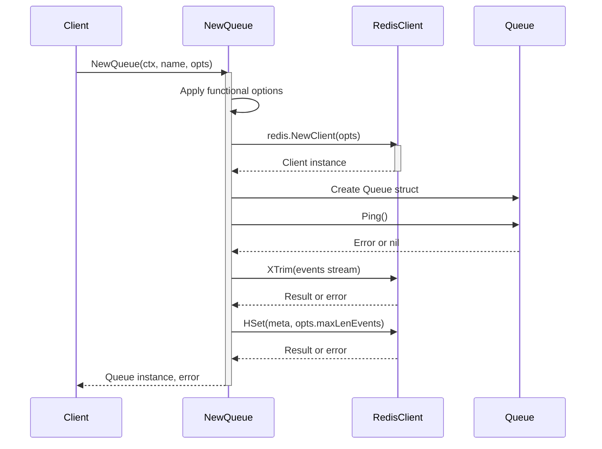
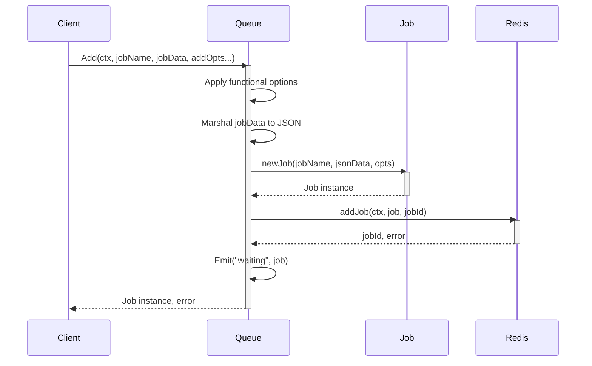
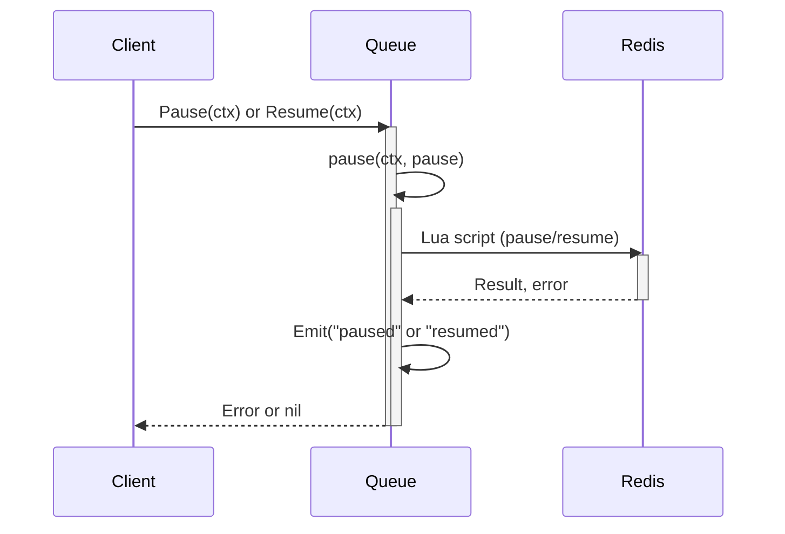
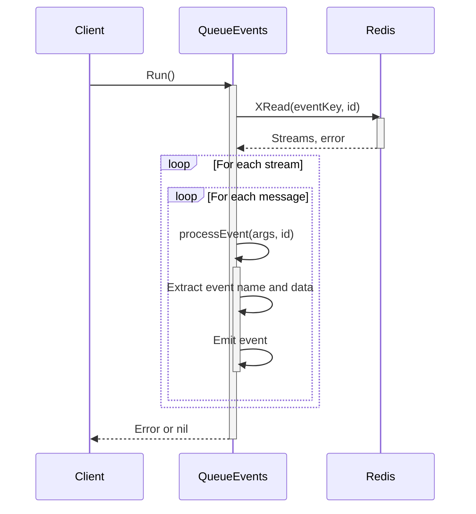

# Queue Management

Queue Management in `gobullmq` involves creating, managing, and processing jobs using Redis. It provides functionalities to add jobs to a queue, pause/resume the queue, check the queue's paused state, and handle job processing with workers. The queue system uses Redis for storing and managing jobs, ensuring persistence and reliability.

This system allows developers to create robust background processing capabilities, schedule tasks, and manage workloads efficiently. It supports features like job prioritization, delayed execution, and repeatable jobs. The following sections detail the various aspects of queue management within the `gobullmq` library.

## Queue Creation and Initialization

The `Queue` struct represents a job queue. A new queue is created using the `NewQueue` function, which takes a context, a queue name, your Redis client, and functional options as parameters.

```go
queueClient := redis.NewClient(redisOpts)
queue, err := gobullmq.NewQueue(ctx, queueName, queueClient,
    // gobullmq.WithKeyPrefix("myCustomPrefix"),
)
if err != nil {
	fmt.Println("Error initializing queue:", err)
	return
}
```

Functional options like `WithKeyPrefix` and `WithStreamsEventsMaxLen` are used to configure key prefixing and stream trimming.

### Functional Options

Functional options provide a flexible way to configure the queue during initialization. Here's a breakdown of the available options:

- **`WithKeyPrefix(string)`**: Sets a custom prefix for Redis keys. The default prefix is "bull".
- **`WithStreamsEventsMaxLen(int64)`**: Sets the maximum length for the events stream. The default value is 10000.

### Redis Client

You are responsible for constructing and passing a `redis.Cmdable` (e.g., `*redis.Client` or `*redis.ClusterClient`). This library does not create connections for you.

### Queue Properties

| Property    | Type              | Description                                                   |
| ----------- | ----------------- | ------------------------------------------------------------- |
| `Name`      | `string`          | The name of the queue.                                        |
| `Token`     | `uuid.UUID`       | A unique identifier for the queue instance.                   |
| `KeyPrefix` | `string`          | The prefix used for all Redis keys associated with the queue. |
| `Client`    | `redis.Cmdable`   | The Redis client used to interact with the Redis server.      |
| `Prefix`    | `string`          | The prefix used for all Redis keys associated with the queue. |
| `ctx`       | `context.Context` | The context used for managing the lifecycle of the queue.     |

### Initialization Sequence Diagram



This diagram illustrates the sequence of steps involved in creating and initializing a new queue, including applying functional options, initializing the Redis client, and setting up the event stream.

## Adding Jobs to the Queue

The `Add` method is used to add new jobs to the queue. It takes a context, a job name, job data, and functional options as parameters. The job data can be any value that is marshallable to JSON.

```go
job, err := queue.Add(ctx, "myJob", jobData,
	gobullmq.AddWithPriority(5),
	gobullmq.AddWithDelay(2000), // Delay by 2 seconds
)
if err != nil {
	log.Fatalf("Failed to add job: %v", err)
}
log.Printf("Added job %s with ID: %s\n", job.Name, job.Id)
```

### Job Options

The behavior of a job can be configured using functional options passed to the `Add` method. These options include:

- **`AddWithPriority(priority int)`**: Sets the priority for the job. Lower numbers indicate higher priority.
- **`AddWithRemoveOnComplete(keep ...types.KeepJobs)`**: Configures job removal upon successful completion.
- **`AddWithRemoveOnFail(keep ...types.KeepJobs)`**: Configures job removal upon failure.
- **`AddWithAttempts(times int)`**: Sets the maximum number of attempts for the job.
- **`AddWithDelay(delayMillis int)`**: Sets an initial delay (in milliseconds) before the job can be processed.
- **`AddWithTimestamp(tsMillis int64)`**: Sets a custom timestamp for the job.
- **`AddWithJobID(id string)`**: Sets a specific ID for the job. Use with caution, as IDs must be unique.
- **`AddWithRepeat(repeatOpts types.JobRepeatOptions)`**: Configures the job to repeat based on the provided options.
- **`AddWithLifo()`**: Adds the job using LIFO (Last In, First Out) order.
- **`AddWithFailParentOnFailure(fail bool)`**: Marks the job to fail its parent job if this job fails.
- **`AddWithParent(parentOpts types.ParentOpts)`**: Sets the parent job information for this job.
- **`AddWithRemoveDependencyOnFailure(remove bool)`**: Marks the job's dependency to be removed from its parent even if this job fails.

### Job Creation Process

1.  **Apply Options:** The functional options are applied to a `JobOptions` struct.
2.  **Validate Job ID:** If a job ID is provided, it is validated to ensure it is not "0" or starts with "0:".
3.  **Marshal Job Data:** The job data is marshaled to JSON.
4.  **Handle Repeatable Jobs:** If the job is repeatable, the `addRepeatableJob` method is called.
5.  **Create Job:** A new `Job` struct is created with the provided data and options.
6.  **Add Job to Queue:** The `addJob` method is called to add the job to the Redis queue.
7.  **Emit Event:** A "waiting" event is emitted.

### Adding a Job Sequence Diagram



This diagram illustrates the sequence of steps involved in adding a job to the queue, including applying functional options, creating a new job instance, and interacting with Redis to persist the job.

## Pausing and Resuming the Queue

The `Pause` and `Resume` methods are used to control the processing of jobs in the queue. Pausing the queue prevents new jobs from being processed, while resuming allows jobs to be processed again.

```go
// Pause pauses the queue, preventing new jobs from being processed.
func (q *Queue) Pause(ctx context.Context) error { // Added context
	if err := q.pause(ctx, true); err != nil {
		return fmt.Errorf("failed to pause queue: %w", err)
	}
	q.Emit("paused")
	return nil
}

// Resume resumes the queue, allowing jobs to be processed.
func (q *Queue) Resume(ctx context.Context) error { // Added context
	if err := q.pause(ctx, false); err != nil {
		return fmt.Errorf("failed to resume queue: %w", err)
	}
	q.Emit("resumed")
	return nil
}
```

### Pause/Resume Implementation

The `pause` method is a helper function that performs the actual pausing or resuming of the queue. It takes a context and a boolean flag indicating whether to pause or resume. The method uses a Lua script to move jobs between the "wait" and "paused" queues.

### Checking the Paused State

The `IsPaused` method checks if the queue is currently paused. It queries Redis to determine if the "paused" key exists in the queue's metadata.

```go
// IsPaused checks if the queue is currently paused.
func (q *Queue) IsPaused(ctx context.Context) (bool, error) { // Added context and error return
	pausedKeyExists, err := q.Client.HExists(ctx, q.KeyPrefix+"meta", "paused").Result()
	return pausedKeyExists, err
}
```

### Pause/Resume Sequence Diagram



This diagram illustrates the sequence of steps involved in pausing or resuming the queue, including executing the Lua script and emitting the corresponding event.

## Queue Events

The `QueueEvents` struct provides a way to listen to events emitted by the queue, such as job completion, job failure, and queue pausing/resuming.

### Event Handling

The `QueueEvents` struct uses an event emitter to manage event listeners. The `On`, `Off`, and `Once` methods are used to add and remove event listeners.

### Running Queue Events

The `Run` method starts the queue events and listens for events from the Redis stream. It uses the `XRead` command to read messages from the stream and the `processEvent` method to process each event.

### Event Processing

The `processEvent` method extracts the event name and data from the message and emits the corresponding event. It handles specific events like "progress" and "completed" by unmarshaling the JSON data associated with the event.

### Queue Events Sequence Diagram



This diagram illustrates the sequence of steps involved in running the queue events, including reading messages from the Redis stream and processing each event.
