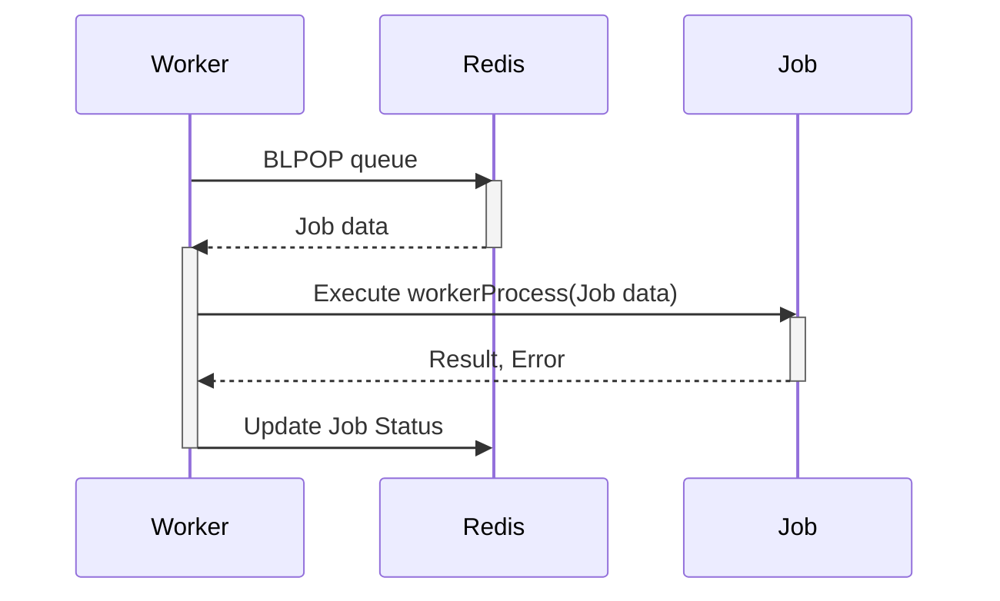

# Worker Processing

Worker processing in `gobullmq` is the mechanism by which jobs are consumed and processed from a queue. Workers are responsible for executing the tasks defined within a job's data, handling potential errors, and updating the job's status. This system ensures that tasks are executed reliably and efficiently, even in distributed environments. The worker leverages Redis for queue management and coordination.

Workers are initialized with specific concurrency settings and a processing function. They listen for new jobs on the queue, execute the processing function, and handle the results. The system also includes mechanisms for handling stalled jobs and managing job lifecycle events.

## Worker Initialization and Configuration

A worker is initialized using the `NewWorker` function, which requires a context, queue name, `WorkerOptions`, a Redis client, and a worker process function. The `WorkerOptions` struct allows configuration of concurrency, stalled job intervals, and retry backoff.

```go
workerClient := redis.NewClient(redisOpts)
worker, err := gobullmq.NewWorker(ctx, queueName, gobullmq.WorkerOptions{
    Concurrency:     1,
    StalledInterval: 30000,
    Backoff:         &gobullmq.BackoffOptions{Type: "exponential", Delay: 500},
}, workerClient, workerProcess)
if err != nil {
    fmt.Println("Error initializing worker:", err)
    return
}
```

### Worker Options

The `WorkerOptions` struct configures the behavior of the worker.

| Option            | Type  | Description                                                                                                                                                                         |
| ----------------- | ----- | ----------------------------------------------------------------------------------------------------------------------------------------------------------------------------------- |
| `Concurrency`     | `int` | The number of concurrent jobs the worker can process.                                                                                                               |
| `StalledInterval` | `int` | The interval (in milliseconds) for checking stalled jobs. Stalled jobs are jobs that were being processed but the worker crashed or failed to update their status.  |

### Worker Process Function

The worker process function defines the logic for each job. It receives a context, the `Job`, and an `api` exposing helpers for updating progress, updating data, and extending the lock.

```go
workerProcess := func(ctx context.Context, job *types.Job, api gobullmq.WorkerProcessAPI) (interface{}, error) {
    fmt.Printf("Processing job: %s\n", job.Id)
    _ = api.UpdateProgress(ctx, job.Id, 10)
    _ = api.ExtendLock(ctx, job)
    return "ok", nil
}
```

## Job Processing Flow

The worker processes jobs in a loop, fetching jobs from the queue and executing the worker process function. The following diagram illustrates the job processing flow:



This sequence diagram illustrates the basic flow of a worker pulling a job from the queue, processing it, and then updating the job status.

## Handling Job Completion and Failure

After processing a job, the worker updates the job's status in Redis. If the job completes successfully, it is moved to the 'completed' set. If the job fails, it is moved to the 'failed' set. The `JobMoveToFailed` function in `job.go` handles moving a job to the failed state.

```go
func JobMoveToFailed(s *scripts, job *types.Job, err error, token string, removeOnFailed types.KeepJobs, fetchNext bool) error {
	job.FailedReason = err.Error()

	// TODO: Consider saving stacktrace here if needed, similar to JS version.

	keys, args, scriptErr := s.moveToFailedArgs(job, job.FailedReason, removeOnFailed, token, fetchNext)
	if scriptErr != nil {
		// Consider emitting an error event here or logging
		return fmt.Errorf("error preparing move to failed args for job %s: %w", job.Id, scriptErr)
	}

	// Use the keys and args here to call the appropriate Lua script
	_, luaErr := lua.MoveToFinished(s.redisClient, keys, args...)
	if luaErr != nil {
		// Consider emitting an error event here or logging
		return fmt.Errorf("error executing move to failed via Lua for job %s: %w", job.Id, luaErr)
	}

	// TODO: Consider emitting a 'failed' event here, although the worker currently does this.

	return nil
}
```

The `moveToFailedArgs` function prepares the arguments for the Lua script that moves the job to the failed set.

## Stalled Job Detection

Workers periodically check for stalled jobs. A stalled job is one that was being processed by a worker that crashed or failed to update the job's status. The `StalledInterval` option in `WorkerOptions` determines how often the worker checks for stalled jobs.

## Worker Events

Workers emit events for various job lifecycle stages, such as 'error'. These events can be listened to for monitoring and logging purposes.

```go
worker.On("error", func(args ...interface{}) {
    fmt.Println("Worker error:", args)
})
```